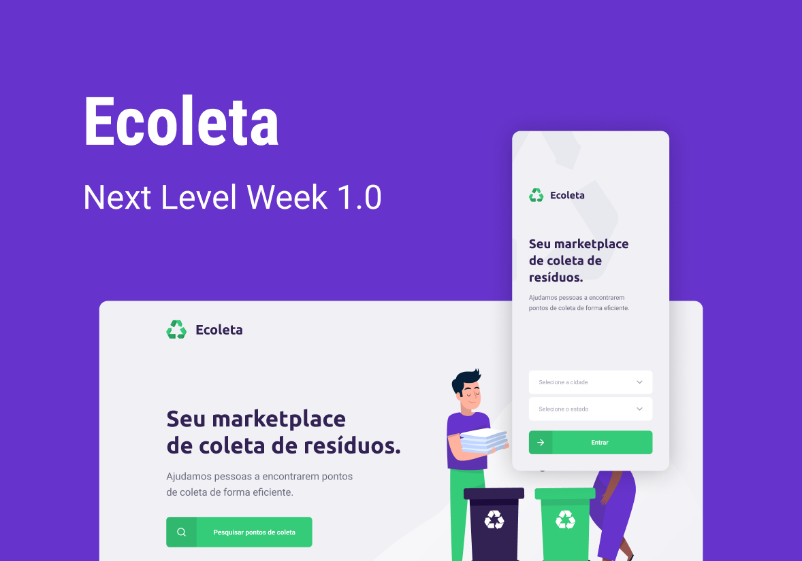

<h1 align="center">
    
</h1>

  
  
  
   

## :question: Next Level Week
NLW is a practical week with lots of code, challenges, networking and a single objective: to take you to the next level.
Through our method you will learn new tools, learn about new technologies and discover hacks that will boost your career.
An online and completely free event that will help you take the next step in your evolution as a dev.

## :computer: Project
The project connects people to companies that collect organic or inorganic waste (cooking oil, light bulbs, batteries).

<h1 align="center">
    
</h1>

## :man_technologist: Technologies
- [Node.js](https://nodejs.org/en/) 
- [React](https://reactjs.org)
- [React Native](https://facebook.github.io/react-native/)
- [Expo](https://expo.io/)

## :gift: Layout
To access full layout use [Figma](https://www.figma.com/file/1SxgOMojOB2zYT0Mdk28lB/Ecoleta?node-id=0%3A1)
